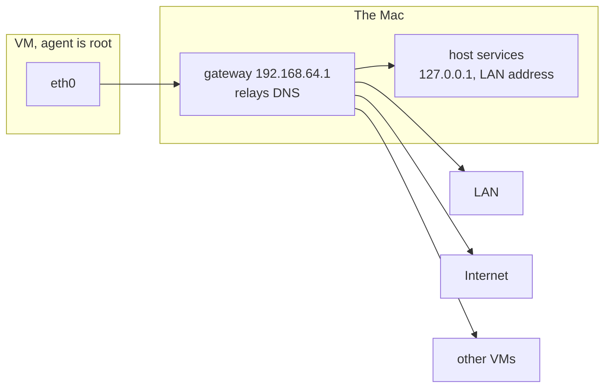
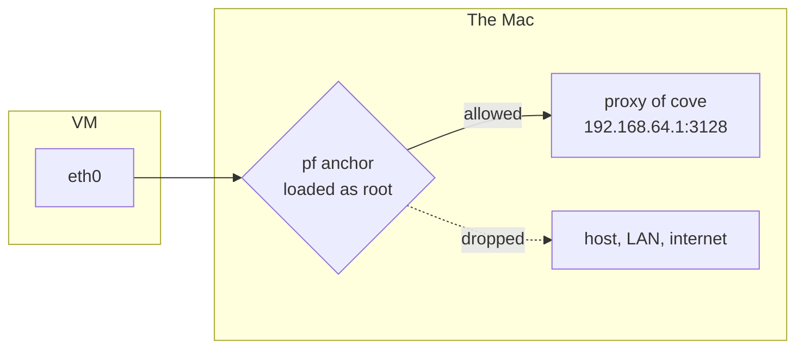
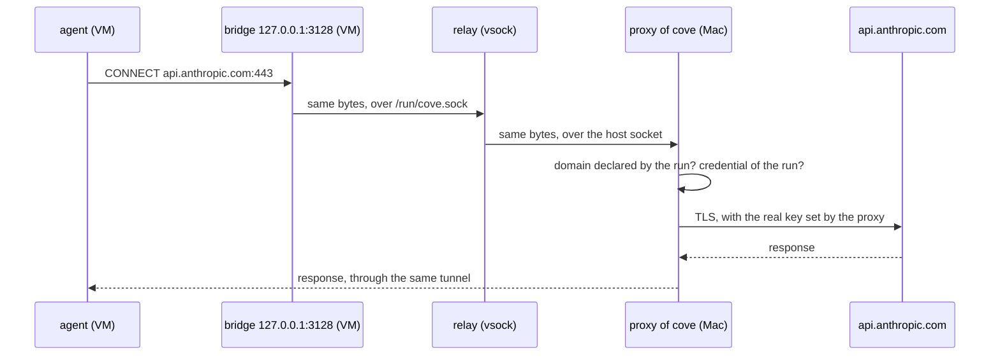
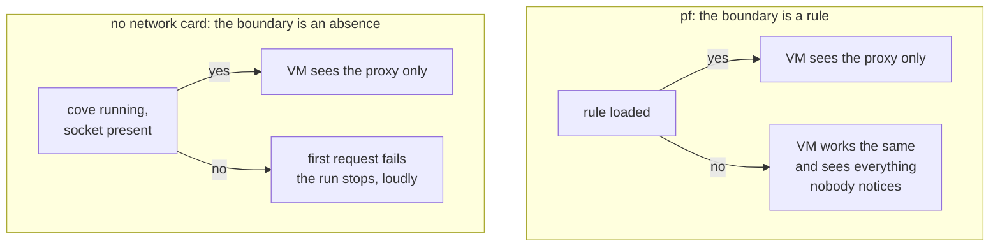

# The single route on Apple container

How cove gives a VM run by Apple `container` exactly one way out, the proxy of
cove, without a firewall rule and without root. Written for a reader who has
never opened a socket by hand: every term is defined where it first appears.

## The problem

The contract asks one thing of the network layer:

> The only destination reachable from the VM is cove's proxy. One address, one
> port, and nothing else: no internet, no LAN, no host, no neighbouring VM, no
> provider metadata endpoint, no DNS server.

It asks for that because the agent is **root** inside the VM, the user that
can do anything on the guest system. A rule placed inside the VM is a rule the
agent can remove. The boundary has to sit where the agent has no hands: on the
host, or in the shape of the VM itself.

Out of the box, `container` gives the opposite. A VM joins a NAT network, gets
a virtual network card, a gateway on the Mac, a DNS resolver relayed by that
gateway, and from there the whole world:



Everything on the right of the gateway is a way to exfiltrate the repository
or to reach a credential. The DNS relay alone is enough: data can be encoded
in the names a resolver is asked for, so a reachable resolver is an open
channel even with every port closed.

## Why not a firewall rule

The first answer was `pf`, the packet filter of the macOS kernel, inherited
from OpenBSD. Its rules are loaded with `pfctl`, as root, into named drawers
called **anchors**. Cove would load one anchor per run:

```
block drop out on bridge101 all
pass out quick on bridge101 proto tcp to 192.168.64.1 port 3128 keep state
```

and flush it at stop. The VM keeps its network card and its gateway; the rule
throws away every packet that is not TCP to the proxy.



It works, and it is rejected, for five reasons that all come down to one: the
boundary is a rule that has to exist, and nothing guarantees it does.

| Fragility | What it means in practice |
|---|---|
| Root at every run | Cove asks `sudo` on the very machine it claims to protect, or ships a privileged helper: a second binary, signed and notarised, with its own updates |
| One `pf` for the whole machine | VPNs, Docker Desktop, Tailscale, Little Snitch write anchors too. A tool that reloads `/etc/pf.conf` can drop ours. Cove would have to check the anchor before every turn |
| The interface name is guessed | `bridge101` is handed out on the fly and `container inspect` does not show it. Two VMs started together, or Docker Desktop started in between, and the number moves |
| Subtle semantics | Last matching rule wins unless `quick`, Apple's anchors are evaluated first, and the behaviour changes with macOS versions |
| **It fails open** | If the rule is missing, the VM works exactly the same and sees the whole host. Nothing signals it |

The last row is the decisive one. A boundary that, when it silently breaks,
leaves everything running as if nothing happened, is not a boundary cove can
put its name on.

## The solution: no network card, one socket

Two options of `container run`, combined, give a VM with no network at all and
a single pipe to a process of cove:

```bash
container run --network none -v /var/run/cove/<run>/proxy.sock:/run/cove.sock ...
```

**`--network none`** starts the VM with no virtual network card. Inside, only
`lo` exists, the loopback interface that leads to `127.0.0.1` and nowhere
else. The routing table is empty, there is no resolver. A `curl` to the
internet does not get dropped by a filter: the guest kernel answers "no route"
before any packet exists.

**`-v` with a unix socket as source** is the part found by reading the source
of `container`, not its documentation. A **unix socket** is a communication
endpoint that lives at a file path, `/run/cove.sock`, rather than at an IP and
a port. It goes through no network stack, and access to it is the file
permission. A `-v` normally mounts a directory into the VM through virtiofs, a
shared file system. But a socket is not bytes on a disk, it is a live kernel
object, and virtiofs cannot share one. So `container` does something else when
the source is a socket: it **relays** it. A process of `container` on the Mac
listens on **vsock**, and an agent inside the guest creates `/run/cove.sock`
and forwards every connection over vsock to the host socket.

**vsock** is a socket family made for talking between a VM and its
hypervisor. It is carried by a virtual device, not by a network card, so it
exists even when the VM has no network. Addresses are a pair (context id,
port); the host is context id 2. No IP, no route, no DNS.

```mermaid
flowchart LR
    subgraph vm [VM, no network card, only lo]
        agent[agent, root<br>HTTPS_PROXY=http://127.0.0.1:3128]
        bridge[bridge, in the image<br>listens 127.0.0.1:3128]
        gsock[/run/cove.sock]
        agent --> bridge --> gsock
    end
    gsock ==>|vsock, no network| relay
    subgraph mac [The Mac]
        relay[relay of container]
        hsock[/var/run/cove/run/proxy.sock]
        proxy[proxy of cove<br>speaks HTTP CONNECT]
        relay --> hsock --> proxy
    end
    proxy -->|declared domains only,<br>credentials set here| internet[Internet]
```

Three pieces, and what each one is for:

**The bridge, in the image.** The tools the agent uses, `curl`, `git`, `npm`,
the SDK of the agent itself, read the standard variable `HTTPS_PROXY` and
expect a `host:port` in it. None of them knows how to speak to a socket path.
So the image carries a program of about twenty lines that listens on
`127.0.0.1:3128`, opens `/run/cove.sock` for every connection, and copies bytes
both ways without reading them. It is a compatibility shim, not a security
piece: the agent is root and can kill it or replace it, and gains nothing by
doing so, because the only thing at the other end of any path is the same
socket, hence the same proxy.

**The relay, in `container`.** The only thing that crosses the boundary of the
VM. Cove does not write it and cannot configure it; cove only chooses which
host socket it leads to.

**The proxy, in cove.** It listens on the host socket instead of a TCP port,
and speaks the same protocol it would on a port: **HTTP CONNECT**. When a
client wants HTTPS through a proxy, it cannot hand the request over, since TLS
encrypts it end to end. It sends `CONNECT github.com:443 HTTP/1.1` instead,
and the proxy opens a raw tunnel. That single clear-text line is where the
proxy reads the destination, applies the domain list of the run, refuses what
was not declared, and where the rest of the architecture, TLS termination
with the per-run authority and the credentials set on the way out, is
unchanged.

## The path of one request



Nothing in this sequence carries an IP address inside the VM. The agent talks
to itself, on loopback, and the first thing outside its kernel is cove.

## What was measured

On `container` 1.3.1, macOS 26.5.2, 13 September 2026, from inside a VM
started with the two options above:

- `ip addr` shows `lo` only, `ip route` is empty, there is no resolver.
  Internet, the LAN address of the host, `127.0.0.1` of the host and
  `169.254.169.254` answer "could not connect" with no packet sent.
- An HTTP server on the Mac listening on the host socket is reached with
  `curl --unix-socket /run/cove.sock`.
- The bridge exposes it on `127.0.0.1:3128`, and `HTTPS_PROXY` pointed there
  goes through.
- A scan of vsock ports 1 to 4096 of the host, from the VM, finds nothing that
  answers. This is what turns "one channel" into "one destination": without it
  another vsock listener on the Mac would be a way around the proxy.

## What holds it, and what it costs

**Socket permissions, and why the agent is root.** The relayed socket inherits
the mode of the host socket. The agent is root in the guest, so it opens that
socket whatever the mode says, and the host socket stays `600`, owned by the
user running cove, in a directory only that user can list. Nothing else on the
Mac can write into it.

An agent running under an ordinary uid would invert this. Measured with a
guest user at uid 1000: a host socket in `600` is refused, and the mode has to
be widened to `666` so the guest side can open it, which hands the socket to
every local process of the Mac. The single route would then rest on the
proxy alone refusing what the run did not declare. Root in the guest is a
requirement of the contract for other reasons, and this is one more.

**A behaviour, not a contract.** The relay is what the code of `container`
does today, not what its documentation promises, so a minor release can
change it without calling that a regression. Two answers: cove pins the
version of `container` it accepts, and the measurement above lives in CI as a
test, so that a change breaks a build before it breaks a boundary.

**Effort.** Two to four days: `run` passes the two options and sets
`HTTPS_PROXY`, the image carries the bridge, the proxy listens on a unix
socket.

## Fail closed

The difference with `pf` is not a matter of degree, it is a matter of kind.



With `pf`, the boundary is an object that has to be created, checked and
recreated, and its absence is invisible. With no network card, the boundary is
the absence of a path: nothing to maintain, and if the code of cove is not
there, the VM has nothing. This is the same shape as the other rules of the
contract, a fresh VM instead of a cleaned one, no credential inside instead of
a protected one: replace a guarantee to keep with a property of the
construction.
